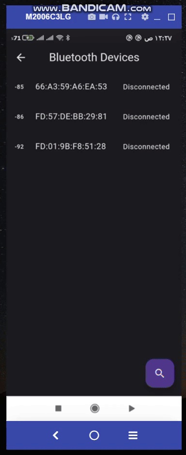

# Webviewer App

## Introduction
This is a Web Viewer App that uses Provider & Mobx to handle state management, also it searches and checks if bluetooth devices are connected or not.

## Webview
> Used packages: Mobx & Provider

### Why Mobx with Provider?
Used Mobx to handle state management of the app, while provider to provide the Mobx to the widget tree and listen to any changes happens, both used for easily readability of code and maintainability.

### Webview Store (Mobx)
1. It can handle the state of the webview screen if it is (loaded, error, etc...)
```dart
    enum WebviewStoreState { loaded, error }
```
2. It also can observer the changes in the url and can reload or clear site from cache using the controller, etc... (some features added and some will be added later)

3. Can handle any error states, for ex: if device is offline will show cached site else if no cache data will handle the error and show it to the user and any other errors (Please check WebviewFailure class).

4. A CustomErrorWidget and beautiful loading indicators are shown to the user.


## Bluetooth devices view
> Used package: flutter_blue_plus.

> Note: Unfortunately flutter_blue_plus was published from 11 days ago (from 6/5/2023) And found it is unstable, some time it shows Bluetooth Device State (connected, disconnected, etc...) and sometimes no (I will change the package later).

- Below you will see that i connected to my bluetooth air pods (named: Aukey), but when i tested on another device and connect to same bluetooth device it shows discconeted, some thing wrong with this package!


### Bluetooth Store (Mobx)
1. It can show the state of devices's bluetooth if it is on or of
```dart
    @observable
    BluetoothState? state;
```

2. Uses only one instance across the whole app (so no need to use service locater/dependency injection).

```dart
    @observable
    FlutterBluePlus flutterBluePlus = FlutterBluePlus.instance;
```
3. The app can handle permissions required to run it, using package `permission_handler`.

## App folder structure
> Divided the app into two folders `core` and `features`.
1. `core` folder, has the constants, Utils (functions, errors, etc..) and widgets that are used across the whole app.
2. `features` folder, the app is divided into features where each feature contains its own view, Mobx store and widgets (using MVVM pattern).
